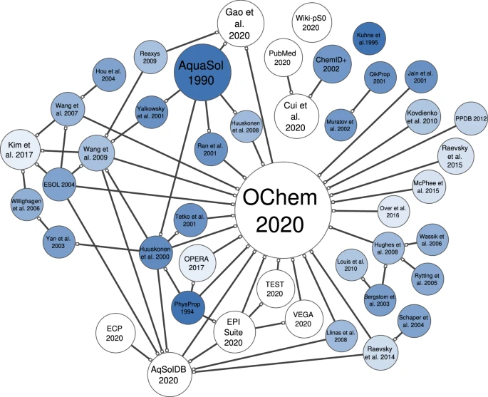

# `raw_datasets` 

## Aqueous solubility datasets
1- `AqSolDB.csv` curated by [AMD](https://www.nature.com/articles/s41597-019-0151-1), downloaded from [Kaggel](https://www.kaggle.com/datasets/sorkun/aqsoldb-a-curated-aqueous-solubility-dataset?resource=download) on 11.Jul.2025.  
2- `solubility_az.csv` by AstraZeneca, downloaded from [ChEMBL](https://www.ebi.ac.uk/chembl/explore/activities/STATE_ID:Cf-PcG3sRc5-IT1rGpRV7g%3D%3D) on 11.Jul.2025.  
3- `biogen.csv` by [BioGen](https://pubs.acs.org/doi/10.1021/acs.jcim.3c00160) downloaded from [GitHub](https://github.com/molecularinformatics/Computational-ADME/blob/main/ADME_public_set_3521.csv) on 11.Jul.2025.  
4- `ESol.csv` by [Delaney](https://pubs.acs.org/doi/10.1021/ci034243x) downloaded from the publication on 11.Jul.2025.  
5- `BigSolDBv2.0.csv` by [Krasnov *et al*](https://chemrxiv.org/engage/chemrxiv/article-details/67f58adcfa469535b9517c75) downloaded from [Zenodo](https://zenodo.org/records/15094979) on 11.Jul.2025. 
6- `SOMAS.csv` by [Gao *et al.*](https://www.nature.com/articles/s41597-022-01814-4) downloaded from [figshare](https://figshare.com/articles/dataset/SOMAS/14552697) on 11.Jul.2025. 

### Comments
- AqSolDB is collected from nine different sources. Some molecules have multiple measurements. Only 3 sources exceed 1000 molecules.
  - Each source is itself a collection from other sources (Check the below figure cited from [Llompart *et al*](https://www.nature.com/articles/s41597-024-03105-6).
- ESol is curated from three different sources with varying molecular size (small, medium, high).
- BigSolDBv2.0 is collected from over 600 source[^1]. It contains different solvents under different temperatures. No combination of source and temperature exceeds 100 molecules.
- SOMAS (shown in the below figure as Gao *et al.* 2020) is collected from over 2K sources[^2] with varying temperatures. Only two sources contain > 1000 molecules.
  - The OChem subset is already shown in the below figure to come from different sources. 
  - The other subset with the suffix `Frontiers in Oncology 2020; 10.doi.10.3389_fonc.20` corresponds to Cui *et al.* 2020 in the below figure and is curated from two other sources.
> ⚠️ Aqueous solubility encapsulates different terms that each corresponds to solubility under different conditions like kinetic solubility, intrinsic solubility, apparent solubility, and water solubility. A single molecule can have different solubility value for each measurement. [Llompart *et al*](https://www.nature.com/articles/s41597-024-03105-6)did a great job at highlighting this nuance, however, the current curation of the datasets does not easily allow for identifying this distinction. This should be seen as a limiting factor for proper learning by an ML model.
- Datasets from AstraZeneca (AZ) and BioGen are curated by a single entity using the same assay.
  - AZ follows [this](https://journals.sagepub.com/doi/full/10.1016/j.jala.2010.10.002) approach to measure solubility in a buffer solution at pH 7.4 starting from a solid material → Apparent solubility
  - BioGen follows [this](https://pubmed.ncbi.nlm.nih.gov/24391097/) approach to measure solubility in a buffer solution at pH 6.8 with a final DMSO concentration of 2% → Kinetic solubility

> ⚠️ Datasets coming from a unified source is considered of higher quality as it has a limited source of noise. Collecting measurements from different assays already introduces noise to the dataset as each experiment, assay, and lab can have variation merely due to experimental setups and not necessarily a feature of the molecule.

- `extract_relevant_fields_and_convert_to_LogS.py` is used to extract the SMILES and the solubility value of each dataset, and converting the value to LogS if not already in this unit.

<figure>
  
  <figcaption> Figure fetched from the Llompart *et. al.* manuscript</figcaption>
</figure>

[^1]: Number obtained by counting unique values in 'Source' column.
[^2]: Number obtained by counting unique values in 'Experiment Reference' column.